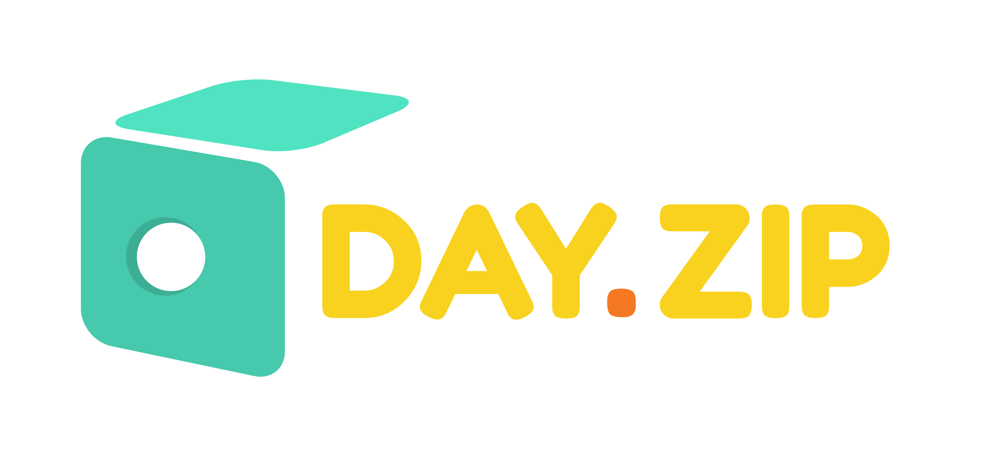

<center>
  
  
</center>

### Dependencies

PI: raspberrypi 4.4.11-v7+

OS: [Raspbian GNU/Linux 8.0 (jessie)](https://www.raspberrypi.org/downloads/raspbian/) (install [NOOB](https://www.raspberrypi.org/downloads/noobs/) before)

### Install

```
curl -L https://git.io/v6vmR | sudo bash
```

Or if you're suspicious of the simplicity of the script above:

```
cd ~
git clone git@github.com:klarna/day.zip.git
cd day.zip
sudo bash boot.sh
```

### Config

To customize your day.zip, simply update the `config.env` file. You can also update the random quotes by changing the `quotes.txt` file.

### Usage

##### day.zip

Your day.zip box works automatically, provided it is turned on and it has internet access. By default, it will take pictures from 8am untill 8pm (you can change this by editing the `crontab-file` and running `crontab crontab-file`) and at the end it will create a time-lapse video and upload to the Instagram & Slack accounts configured in `config.env`.

##### minute.zip

You can also make a quick time-lapse video by just clicking your box's button. It will take shots for one minute and upload to the same accounts above.

### Resources

[Knitting 101](https://www.youtube.com/playlist?list=PLR1ElIXW5YKJFob5KJvHS01Tj30Zyy2EQ)

[How to make a wooden box](http://www.wikihow.com/Make-a-Wooden-Box)

[Building ffmpeg + x264 on RaspberryPi](http://www.jeffreythompson.org/blog/2014/11/13/installing-ffmpeg-for-raspberry-pi/)

[Creating a slideshow with ffmpeg](https://trac.ffmpeg.org/wiki/Create%20a%20video%20slideshow%20from%20images)

[How to set up a scheduled task (Cron) with the Raspberry Pi](https://www.youtube.com/watch?v=UggNZundvPk)

[Slack API: File upload](https://api.slack.com/methods/files.upload/test)

[iPhone time lapse config](http://9to5mac.com/2014/10/01/iphone-time-lapse/)